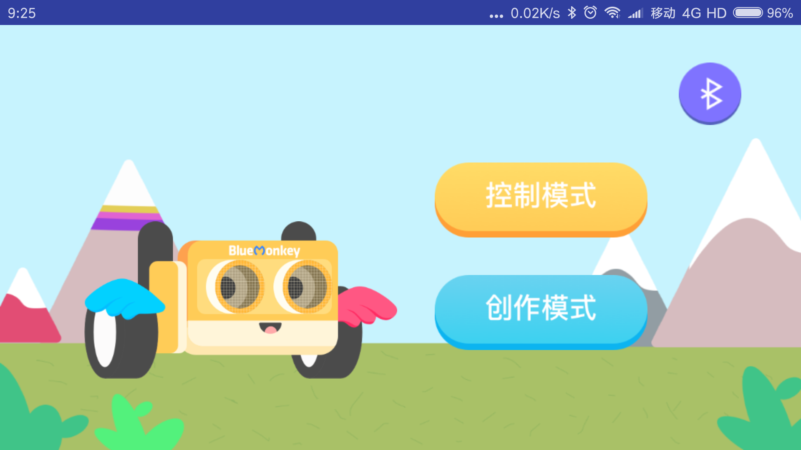
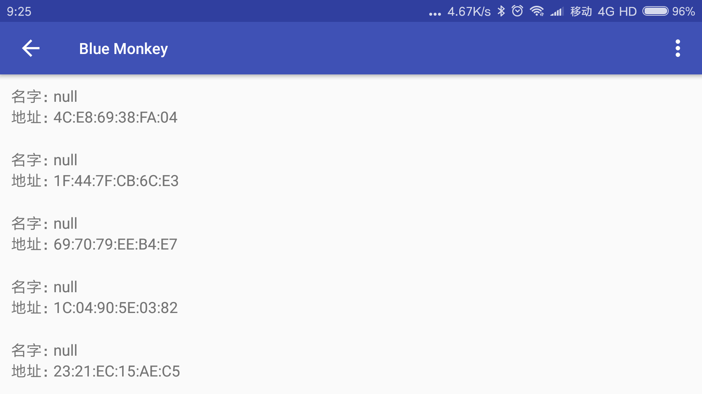
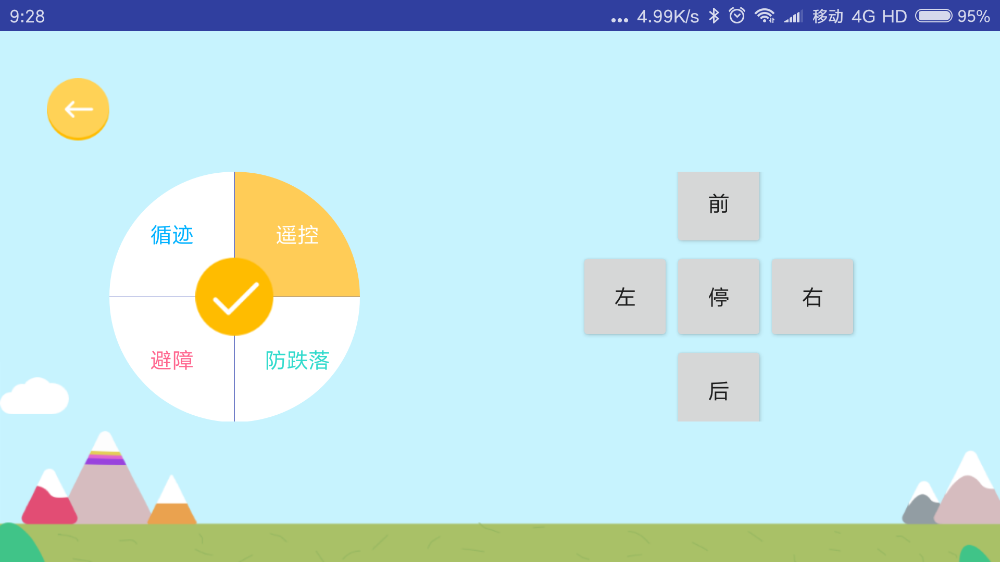
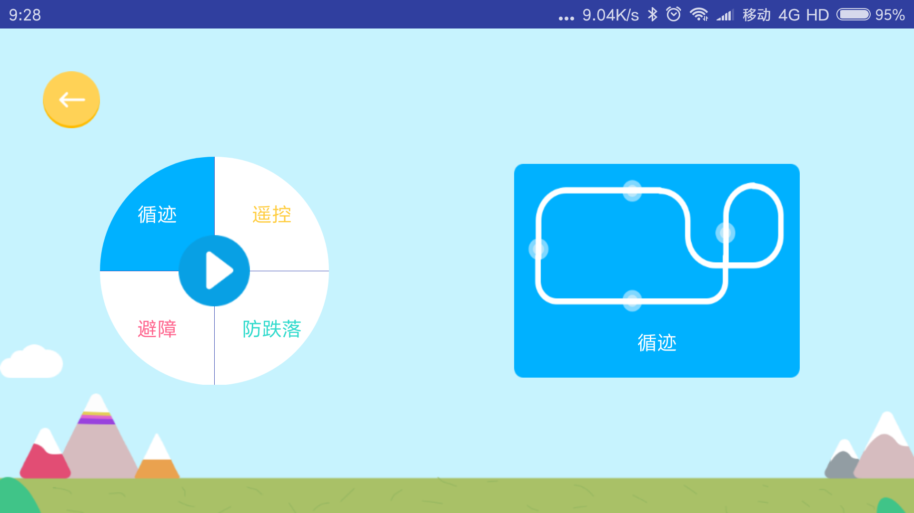
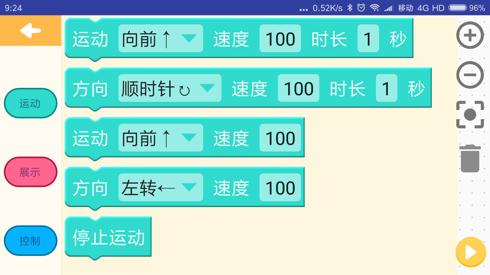
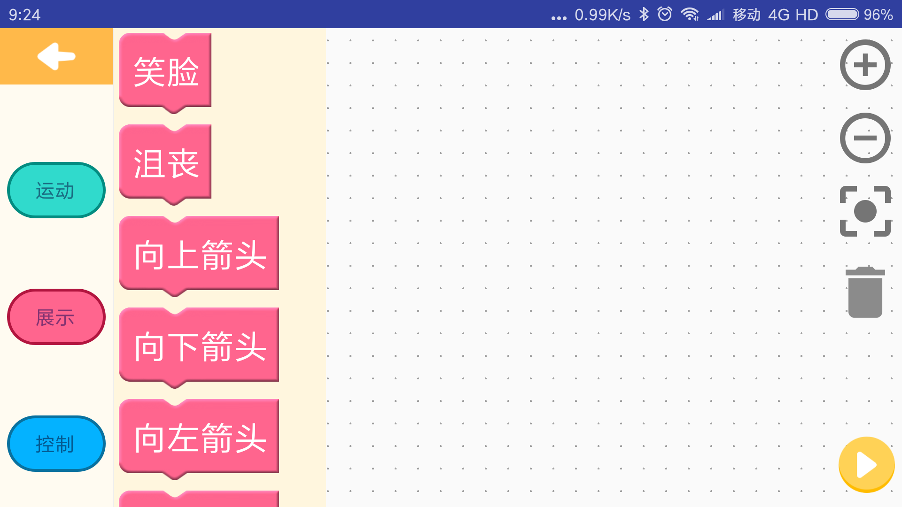
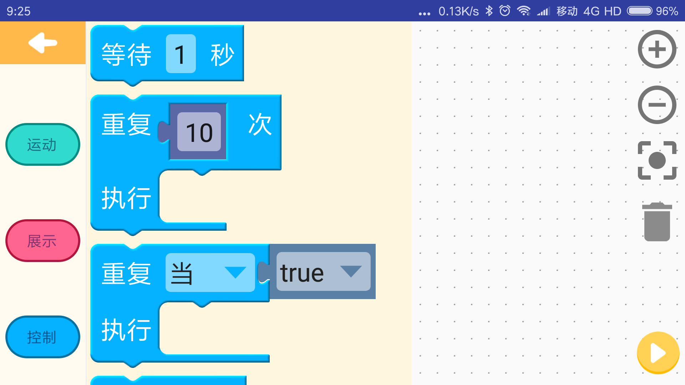

#### Blockly
[Blockly][1] is a library for building drag-and-drop visual editors for
JavaScript and other programming languages.  [Blockly for Android][2] is
a developer preview of Blockly's editor built with standard Android
views and fragments, offering more responsive touch performance and
easier integration in Android apps.

[Get started][3] building your own Android app using Blockly.

Google is proud to offer Blockly for Android for free and open source
under the [Apache License, version 2.0][4].

Blockly has an active [developer forum][5]. Please drop by and say hello. Show
us your prototypes early; collectively we have a lot of experience and can
offer hints which will save you time.

Help us focus our development efforts by telling us [what you are doing with
Blockly][6]. The questionnaire only takes a few minutes and will help us better
support the Blockly community.

Want to contribute? Great! First, read [our guidelines for contributors][7].

[1]: https://developer.google.com/blockly/ "Blockly documentation"
[2]: https://github.com/google/blockly-android "Blockly for Android repository on GitHub"
[3]: https://developer.google.com/blockly/guides/get-started/android "Blockly for Android developer tutorial"
[4]: https://github.com/google/blockly-android/blob/master/COPYING "Apache open source license, version 2.0"
[5]: https://groups.google.com/forum/#!forum/blockly "Blockly developer forum"
[6]: https://developers.google.com/blockly/registration "Blockly developer registration form"
[7]: https://github.com/google/blockly-android/blob/master/CONTRIBUTING.md "Contributor guidelines"

#### 基于Android blockly和蓝牙通信的机器人编程APP
###### 主要功能：
1、在Android blockly的基础上改造，可以实现编程构建

2、蓝牙连接机器人（自主研发的），通过蓝牙与机器人交互

3、自定义blockly模块，UI自定义

4、新增小车文章[智能小车实践](https://www.jianshu.com/p/eb20bcbfff45)

##### 截图
  
  
  

##### 实现原理
1、蓝牙连接，ble蓝牙连接及其通信，主要在bleutils包下面，其他界面相关实现在robot包下

2、Blockly 自定义模块，[创建生成模块](https://blockly-demo.appspot.com/static/demos/blockfactory/index.html#)，构建完毕生成js和json，json为模块解析构建的样式和类型依据，
js为执行相关语句的构建，例如 if else的构建。

3、Blockly编程实现，生成js代码，然后放入webview中加载js，特定的蓝牙通信的指令代码实现其js和Android交互，Android进行蓝牙通讯。

4、js与Android通信为JavaBridge线程，可阻塞。（如果在需要同步阻塞等待设备传回消息，可以参考ShowInterface的sleep方法，循环等待）

5、对于ui的改造，在blocklylib-core中也有，具体可参看源码
